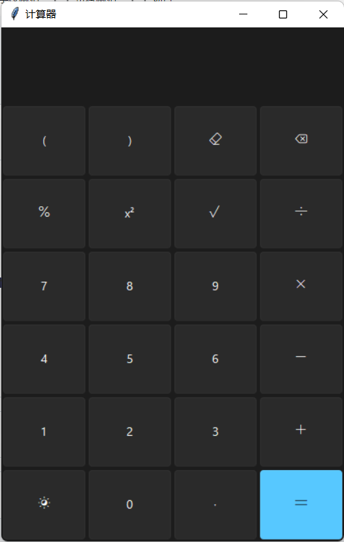
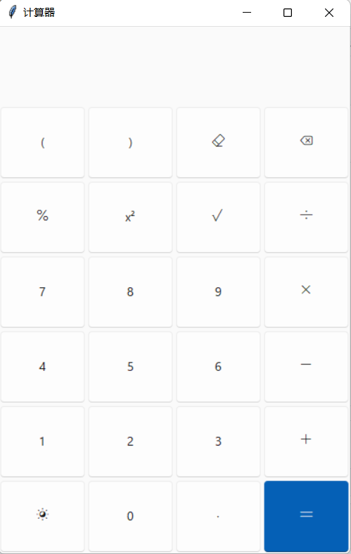

# Calculator
数据结构作业 Python 简易计算器 Python simple calculator
## 项目时间

2024年3月9日 20:00

## 功能特点

- 支持基本的加法、减法、乘法和除法操作
- 提供了一些额外功能，如求平方根、百分比等
- 支持通过键鼠直接在输出框进行编辑
- 提供了清除、回退等操作功能
- 内含表达式的计算（中缀转后缀）
- 支持白天/夜间模式的切换
<div style="display:flex; justify-content:center;">
    
    
</div>


## GUI 设计

计算器应用采用了 Tkinter 库来创建图形用户界面，具体设计如下：

- 计算器界面由一个文本框和一组按钮组成，用于显示输入表达式和计算结果。
- 文本框用于显示当前输入的表达式和计算结果。
- 按钮分为数字按钮、运算符按钮和功能按钮。
- 数字按钮用于输入数字。
- 运算符按钮用于输入加减乘除等运算符。
- 功能按钮包括清除按钮、回退按钮和等号按钮，用于清除当前输入、删除上一个字符和执行计算。
- 计算器应用支持键盘快捷键操作，例如 BackSpace 删除上一个字符，Ctrl + W 关闭应用程序，Enter 执行计算等。

## 使用自定义主题

项目中使用了 `sv_ttk` 模块来定制 Tkinter 控件的主题。

## 安装与使用

1. 克隆项目：

    ```bash
    git clone https://github.com/your-username/calculator.git
    ```

2. 进入项目目录：

    ```bash
    cd code
    ```

3. 运行计算器应用：

    ```bash
    python calculator.py
    ```

## 快捷键

- <kbd>BackSpace</kbd>: 删除上一个输入的字符
- <kbd>Ctrl</kbd> + <kbd>W</kbd>: 关闭应用程序
- <kbd>Escape</kbd>: 清除当前输入
- <kbd>Enter</kbd>: 运行计算
- <kbd>=</kbd>: 运行计算
- <kbd>Space</kbd>: 运行计算

## 贡献

欢迎贡献代码！如果你有任何建议或想要报告问题，请在 GitHub 上提出 issue 或者直接提交 Pull Request。

## 版权

该项目基于 MIT 许可证进行分发。更多信息请参阅 [LICENSE](LICENSE) 文件。
